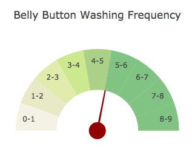

# Belly Button Biodiversity

In this assignment, I built an interactive dashboard to explore the [Belly Button Biodiversity DataSet](http://robdunnlab.com/projects/belly-button-biodiversity/). 

My dashboard was deployed on heroku and can be found at the link below:

https://damp-shelf-17886.herokuapp.com/

I was provided an sqlite file with 3 tables which i used in my dashboard:
* operational taxonomic unit (otu) ids
* sample measurements
* sample metadata
___

## Step 1 - Create Flask API

I created a Flask API using `sqlalchemy` to pull data from the sqlite file provided.  

My API has the routes below:

* `"/"`
    * root route which renders the `index.html` file I created as my dashboard landing page 

```python
@app.route('/')
def index():
    return render_template('index.html')
```

* `"/names"`
    * Returns a list of sample names

```python
@app.route('/names')
def names():
    # query db for sample names
    sample_names = Sample.__table__.columns._data.keys()[1:]
    return jsonify(sample_names)
```

* `"/otu"`
    * Returns a list of OTU descriptions

```python
@app.route('/otu')
def otu():
    # query db otu descriptions
    otu_desc = session.query(OTU)
    # convert to list of values rather than list of tuples
    otu_desc = {desc.otu_id: desc.lowest_taxonomic_unit_found for desc in otu_desc}
    return jsonify(otu_desc)
```

* `"/metadata/<sample>"`
    * Returns a json dictionary of sample metadata for a given sample

```python
@app.route('/metadata/<sample>')
def metadata(sample):
    # remove prefix from sample name
    sample = sample.lstrip('BB_')
    
    # query db and filter for given sample
    meta_data = (session
                .query(Sample_Meta)
                .filter(Sample_Meta.SAMPLEID == sample))

    for result in meta_data:
        meta_dict = {
            'AGE': result.AGE,
            'BBTYPE': result.BBTYPE,
            'ETHNICITY': result.ETHNICITY,
            'GENDER': result.GENDER,
            'LOCATION': result.LOCATION,
            'SAMPLEID': result.SAMPLEID,
        }

    return jsonify(meta_dict)
```

* `"/wfreq/<sample>"`
    * Returns an integer value for the weekly washing frequency of a given sample

```python
@app.route('/wfreq/<sample>')
def wfreq(sample):
    # remove prefix from sample name
    sample = sample.lstrip('BB_')
    
    # query db for wfreq and return as scalar
    wfreq_query = (session
            .query(Sample_Meta.WFREQ)
            .filter(Sample_Meta.SAMPLEID == sample)
            .scalar())

    return jsonify(wfreq_query)
```

* `"/samples/<sample>"`
    * Returns a list of dictionaries containing sorted lists  for `otu_ids`
    and `sample_values`

```python
@app.route('/sample/<sample>')
def sample(sample):
    # query db for sample value and otu_id
    sample_query = session.query(Sample.otu_id, getattr(Sample, sample))

    # sort sample values in descending order
    sample_query = sorted(sample_query, key=lambda x: x[1], reverse=True)

    # create dict with lists of ids and sample values  
    sample_dict = {
        'otu_ids': [otu[0] for otu in sample_query],
        'sample_values': [otu[1] for otu in sample_query]
    }

    return jsonify(sample_dict)
```
___

## Step 2 - Plotly.js

I used Plotly.js to build interactive charts for my dashboard.

My dashboard consists of:

* A dropdown select list which was populated with the results from the `/names` route. 

    

* A PIE chart that uses data from the `/samples/<sample>` and `/otu` routes to display the top 10 otu values for a given sample

    

* A Bubble Chart that uses data from the routes `/samples/<sample>` and `/otu` to plot the __Sample Value__ vs the __OTU ID__ for the selected sample.

    


* A div containing the selected sample's metadata from the route `/metadata/<sample>`

    

* A Guage Chart that uses data from the route `/wfreq/<sample>` which shows the bellybutton washing frequency for a given sample

    

* All of the dashboard components update using `JavaScript` with the user's selection from the provided dropdown

    [this code can be seen here](app/static/js/app.js)
